# praktikum 4
#### nama : rizky syahhendra fanani
#### kelas: 2.A
#### nim  : 312210686

## Latihan 1
### Buat program sederhada dengan input 2 buah bilangan, kemudian tentukan bilangan terbesar dari kedua bilangan tersebut menggunakan statement if.
#### Penjelasan program
##### 1.	user1=int(input("Masukan bil pertama = ")) Untuk menentukan jumlah input yang di inginkan sesuai tipe data yaitu interger tipe data bilangan bulat
##### 2.	user2=int(input("Masukan bil kedua = ")) Untuk menentukan jumlah input yang di inginkan sesuai tipe data yaitu interger tipe data bilangan bulat
##### 3.	if untuk membandingkan kedua bilangan user1 dan user2 jika true maka akan mencetak print(f"{user1} lebih besar dari {user2}")
##### 4.	Jika false maka program akan mencetak print(f"{user1} lebih kecil dari {user2}")
#### Gambar program
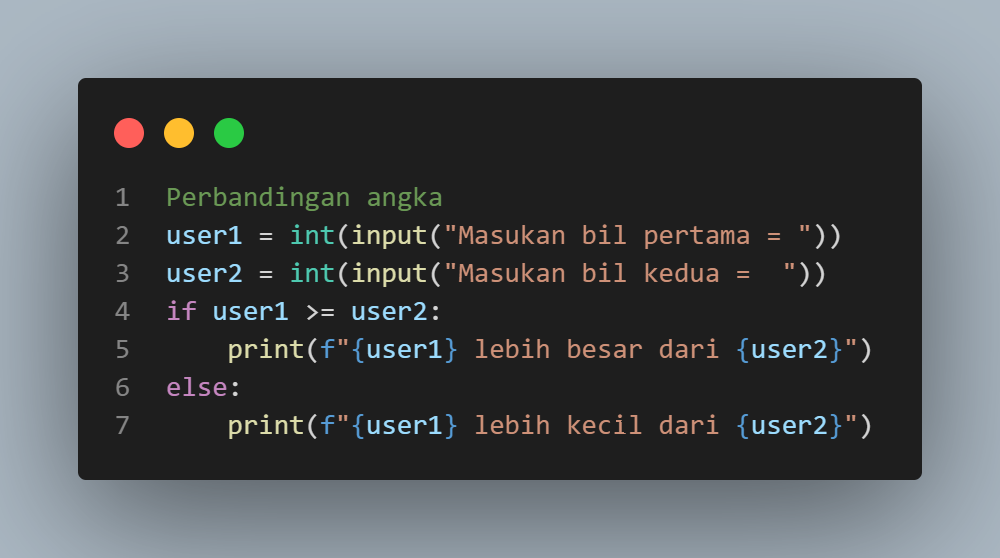
#### Hasil Program / Output
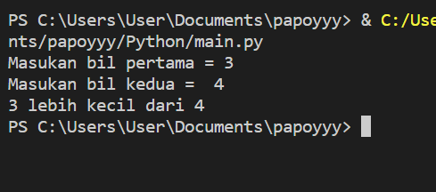
#### jika program false
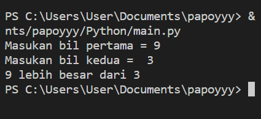
#### jika program true
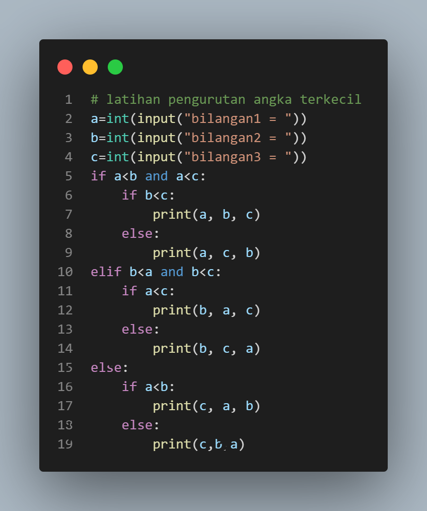
## Latihan 2
### Buat program untuk mengurutkan data berdasarkan input sejumlah data (minimal 3 variable input atau lebih), kemudian tampilkan hasilnya secara berurutan mulai dari data terkecil.
#### Gambar Program
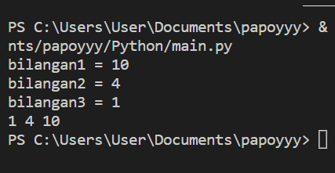
#### Hasil program
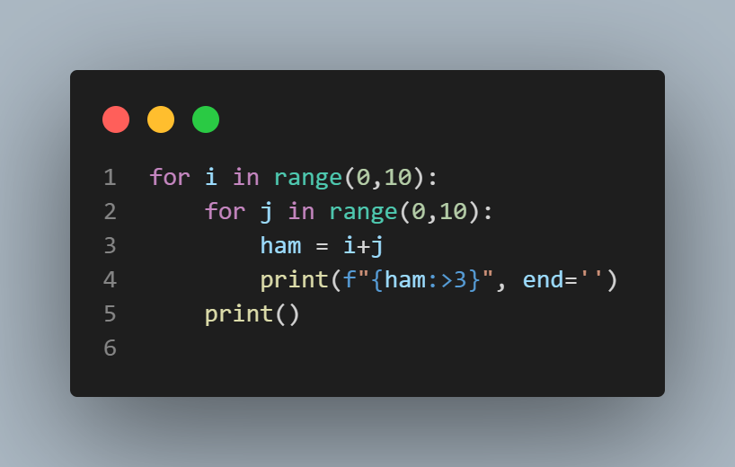
#### / Output
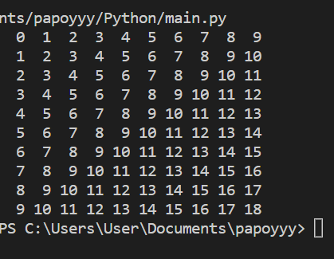
## Latihan 3 (Perulangan)
Buat program dengan perulangan bertingkat (nested) for
#### Gambar Program
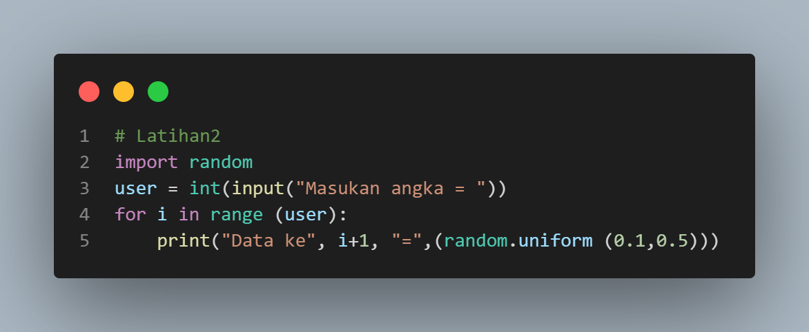
#### Hasil program / Output
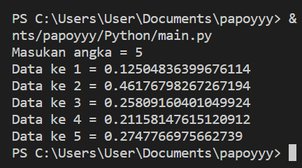
## Latihan 4 (Perulangan)
###### 1. Tampilkan n bilangan acak yang lebih kecil dari 0.5.
###### 2. Nilai n diisi pada saat runtime
###### 3. Anda bisa menggunakan kombinasi while dan for untuk menyelesaikannya
#### Gambar program
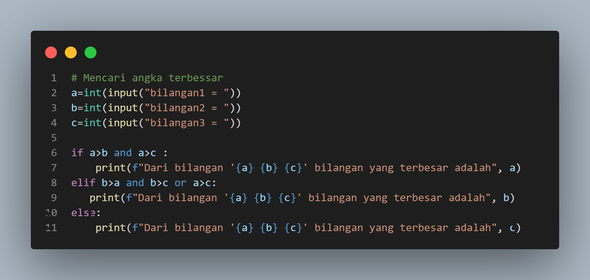
#### Penjelasan Program
###### 1.	Import random dari library python
###### 2.	user=int(input("Masukan angka = ")) Untuk menentukan jumlah input yang di inginkan sesuai tipe data yaitu interger tipe data bilangan bulat
###### 3.	for i in range ( user ) : Untuk Pengulangan dengan range user
###### 4.	lalu cetak print("Data ke", i+1, "=",(random.uniform (0.1,0.5))) dan memanggil random dengan range 0.1 sampai 0.5
###### Hasil program / Output
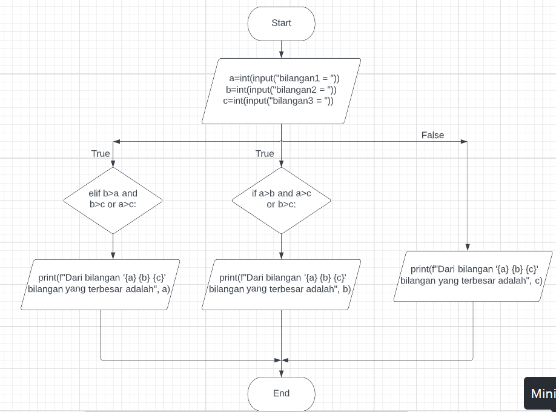
## Tugas Praktikum 2
#### Buat program sederhana dengan input tiga buah bilangan, dari ketiga bilangan tersebut tampilkan bilangan terbesarnya. Gunakan statement if.
#### Gambar Program

##### Penjelasan Program
###### 1.	a=int(input("Masukan angka = ")) Untuk menentukan jumlah input yang di inginkan sesuai tipe data yaitu interger tipe data bilangan bulat.
###### 2.	b=int(input("Masukan angka = ")) Untuk menentukan jumlah input yang di inginkan sesuai tipe data yaitu interger tipe data bilangan bulat.
###### 3.	c=int(input("Masukan angka = ")) Untuk menentukan jumlah input yang di inginkan sesuai tipe data yaitu interger tipe data bilangan bulat.
###### 4.	if a>b and a>c: print(f"Dari bilangan '{a} {b} {c}' bilangan yang terbesar adalah", a) Artinya jika a lebih besar dari b dan, a lebih besar dari c maka print a
###### 5.	elif b>a and b>c or a>c: print(f"Dari bilangan '{a} {b} {c}' bilangan yang terbesar adalah", b) Artinya jika b lebih besar dari a dan, b lebih besar dari c, atau a lebih besar dari c maka print b
###### 6.	Jika bilangan a atau b lebih kecil dari c maka print c
###### Flowchart

#### Hasil Program / Output

![Gambar1]6(.png)
## Tugas Praktikum 3
### Program Sederhana Untuk Menghitung Jumlah Laba Hasil Investasi Seorang Pengusaha Selama 8 Bulan
#### Gambar Program

#### Penjelasan Program
###### 1.	x=100000000 Dengan pemisalan atau dideklarasikan x adalah 100000000
###### 2.	print (" Modal Awal:",x) Menampilkan kalimat Modal Awal : dan data yang berisi di x yaitu 100000000
###### 3.	a=0x, b=0x, c=0.01x, d=0.01x, e=0.05x, f=0.05x, g=0.05x, h=0.03x Untuk Mendeklarasikan presentase laba tiap bulan dan di kali dengan x atau data inputan modal investasi yaitu 100000000
###### 4.	y=[a,b,c,d,e,f,g,h] untuk menentukan syarat y= yang berisi a,b,c,d,e,f,g,h
###### 5.	For i in range (len (y)) Print (“laba bulan ke-“,i+1,”sebesar:” ,y[i]) untuk perulangan data dengan isi data yaitu Ydengan menampilkan urutan laba perbulan sesuai range yang di tentukan dengan hasil ke untukan yang di inpput dari data Y
###### 6.	Z= (a+b+c+d+e+f+g+h) Print (“jumlah laba selama 8 bulan adalah:”) Z berisi data penjumlahan data angka yang ada didalam kode a,b,c,d,e,f,g,h yang akan di tampilakan atau dicetak di jumlah laba selama 8 bulan
#### Flowchart

#### Hasil Program / Output

# Latihan 1.py
###### Program Untuk Menampilkan N Bilangan Acak Yang Lebih Kecil Dari 0.5
##### Penjelasan Program
#### Gambar Program

###### 1.	Import random dari library python
###### 2.	user=int(input("Masukan angka = ")) Untuk menentukan jumlah input yang di inginkan sesuai tipe data yaitu interger tipe data bilangan bulat
###### 3.	for i in range ( user ) : Untuk Pengulangan dengan range user
###### 4.	lalu cetak print("Data ke", i+1, "=",(random.uniform (0.1,0.5))) dan memanggil random dengan range 0.1 sampai 0.5
#### Flowchart
#### Hasil Program / Output

